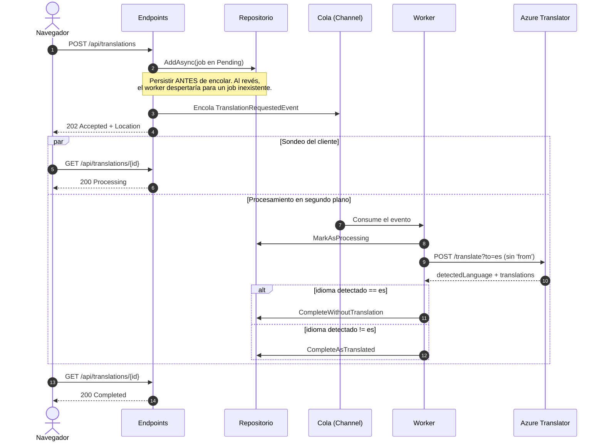
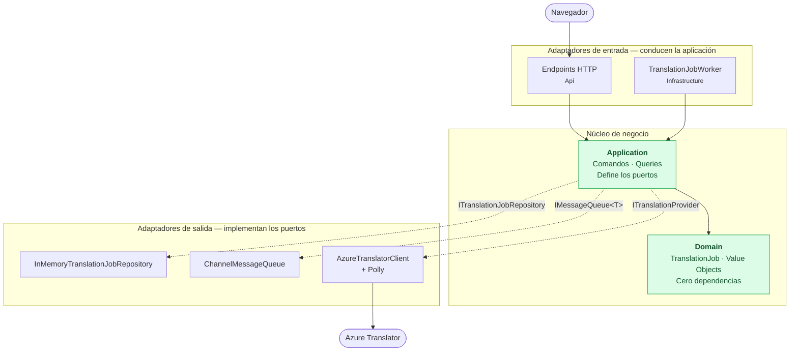
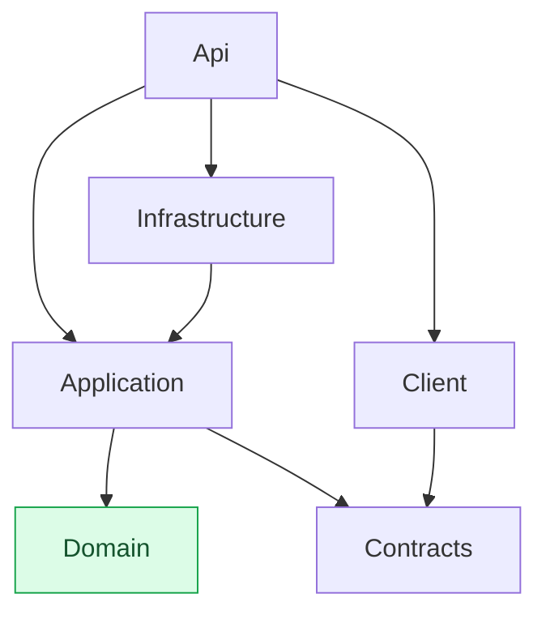
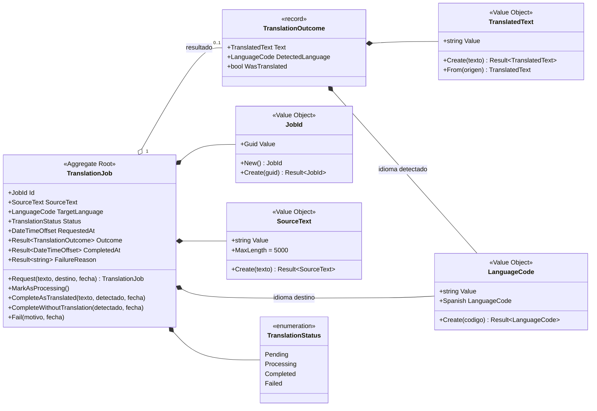
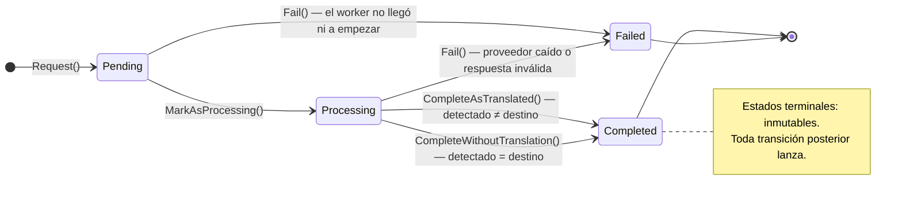
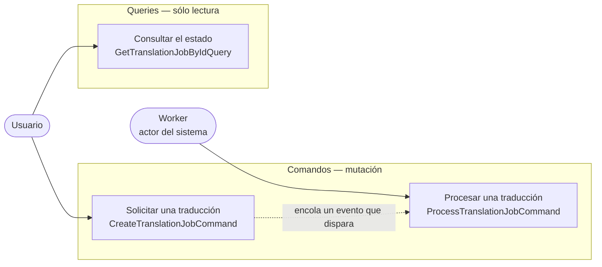

# Translation Service

Servicio de traducción asíncrona sobre **Azure Translator**, construido con .NET 10 y Blazor WebAssembly bajo Arquitectura Hexagonal, DDD y CQRS.

**Demo:** https://translation-service-app.gentlecliff-9f1cb864.germanywestcentral.azurecontainerapps.io

> La aplicación escala a cero cuando no se usa, así que la primera carga tarda entre 10 y 35 segundos. Las siguientes son inmediatas.

---

## Qué hace

Escribes un texto en cualquier idioma y lo traduce al español. Si ya está en español, te lo devuelve intacto y te dice por qué.

La gracia no está en traducir, sino en **cómo**: la API no traduce durante la petición HTTP. Acepta el trabajo, devuelve `202 Accepted` de inmediato y traduce en segundo plano. El cliente sondea hasta que el trabajo alcanza un estado terminal. Es el patrón **Asynchronous Request-Reply**, y es lo que permite que una llamada externa lenta o caída no bloquee ni tumbe la API.

---

## Arranque rápido

**Requisitos:** SDK de .NET 10, Node.js 20+, y una clave de Azure Translator.

```bash
git clone https://github.com/nomucode/TranslationServiceApp.git
cd TranslationServiceApp

# La clave nunca se versiona: vive en user-secrets.
dotnet user-secrets set "AzureTranslator:ApiKey" "<tu-clave>"   --project TranslationService.Api
dotnet user-secrets set "AzureTranslator:Region" "<tu-región>"  --project TranslationService.Api

dotnet run --project TranslationService.Api
```

| | |
|---|---|
| Aplicación | http://localhost:5111 |
| API | http://localhost:5111/api/translations |
| Documentación interactiva | http://localhost:5111/scalar/v1 |

Un solo proceso sirve la API y el SPA. Tailwind se compila automáticamente durante el build de MSBuild; no hace falta ejecutar `npm` a mano.

Si no pones la clave, la aplicación **no arranca** y te dice exactamente qué falta. Es deliberado: mejor un fallo explícito al inicio que un 500 la primera vez que alguien intente traducir.

### La API

```http
POST /api/translations
Content-Type: application/json

{ "text": "Good evening, where is the nearest pharmacy?" }
```

```http
HTTP/1.1 202 Accepted
Location: /api/translations/01a0576d-3b5f-745b-8f49-c4b5ea2d2264

{ "jobId": "01a0576d-…", "status": "Pending", "statusUrl": "/api/translations/01a0576d-…" }
```

```http
GET /api/translations/01a0576d-…
```

```json
{
  "status": "Completed",
  "sourceText": "Good evening, where is the nearest pharmacy?",
  "translatedText": "Buenas noches, ¿dónde está la farmacia más cercana?",
  "detectedLanguage": "en",
  "wasTranslated": true,
  "processingTimeMs": 418,
  "isTerminal": true
}
```

Los errores son `ProblemDetails` (RFC 7807) con un código de dominio estable en la extensión `code`, para que el cliente ramifique por `SourceText.TooLong` sin parsear mensajes.

---

## Arquitectura

### El flujo asíncrono



El `202` sale **antes** de hablar con Azure. Hay un test que lo blinda: con un proveedor que tarda 2 segundos a propósito, el `POST` sigue respondiendo en menos de uno.

### Puertos y adaptadores

Todas las flechas apuntan **hacia** el núcleo (en verde) o salen de él a través de un puerto. Las discontinuas son esos puertos: interfaces que define `Application` y que `Infrastructure` implementa, de modo que la dependencia se invierte y el núcleo no conoce a nadie.

Este diagrama muestra **dependencias**, no flujo en ejecución; para eso está el diagrama de secuencia de arriba.



### Dependencias entre proyectos



`Domain` (en verde) no tiene ni una sola referencia externa, ni siquiera a `Microsoft.Extensions`. `Contracts` existe porque el cliente WASM necesita los DTOs y no puede referenciar `Application`: arrastraría `Domain` al navegador y rompería la regla de dependencias.

| Proyecto | Responsabilidad |
|---|---|
| **Domain** | Agregado `TranslationJob`, Value Objects, `Result<T>`, puerto del repositorio. Sin una sola dependencia externa, ni siquiera de Microsoft.Extensions. |
| **Application** | Comandos y queries con sus handlers. Define los puertos de salida (`ITranslationProvider`, `IMessageQueue<T>`). |
| **Infrastructure** | Los adaptadores: repositorio en memoria, cola sobre Channels, worker, cliente de Azure con Polly. |
| **Api** | Composition root, endpoints mínimos, `ProblemDetails`, hosting del SPA. |
| **Contracts** | DTOs de transporte compartidos entre API y cliente. Sin dependencias. |
| **Client** | SPA Blazor WebAssembly con Tailwind. |

---

## El dominio

### Modelo



El agregado no expone ni un solo `setter` público: todo cambio de estado pasa por un método de intención. `Outcome`, `CompletedAt` y `FailureReason` son `Result<T>` en lugar de nullables, así que el consumidor está obligado a contemplar el caso «todavía no hay resultado».

### Máquina de estados

Cualquier transición fuera de este grafo lanza `InvalidJobStateTransitionException`. No es un caso de uso: es un defecto de programación y debe explotar ruidosamente.



Las dos aristas hacia `Completed` son **mutuamente excluyentes por construcción**: cada método lanza si la condición del otro se cumple. Es lo que hace imposible falsear `wasTranslated`.

### Casos de uso



La separación no es cosmética: el handler de lectura no recibe ninguna dependencia de escritura, lo que permitiría apuntarlo a una réplica de sólo lectura sin tocar nada más.

---

## Decisiones de diseño

Lo que sigue es el porqué de las decisiones que no son obvias, con sus contrapartidas.

### La regla de negocio es una invariante, no un `if`

El requisito «si el idioma detectado es español, no traducir» podría vivir como un condicional en el worker. Vive en el agregado, con **dos métodos de completado mutuamente excluyentes**:

- `CompleteAsTranslated(...)` **lanza** si el idioma detectado coincide con el destino.
- `CompleteWithoutTranslation(...)` **lanza** si no coincide.

Es imposible que la capa de aplicación produzca un `wasTranslated` falseado. La regla no puede saltarse por accidente en un refactor.

### Una sola llamada a Azure, no dos

Se usa `/translate?to=es` **omitiendo el parámetro `from`**. Azure autodetecta el idioma y devuelve `detectedLanguage` junto con la traducción, así que detección y traducción se resuelven en una sola llamada.

**Contrapartida:** cuando el texto ya está en español, Azure lo traduce igualmente y se descarta el resultado — se paga una traducción que no se usa. La alternativa (`/detect` y luego `/translate`) evita ese coste pero añade un viaje de ida y vuelta a **todos** los demás casos, que son la mayoría. Se optimizó para el caso común.

### `Result<T>` y excepciones, con un criterio explícito

Ambos, pero nunca arbitrariamente:

| Situación | Mecanismo | Por qué |
|---|---|---|
| Value Object inválido | `Result<T>` | La entrada viene de fuera y no es de confianza. El fallo es esperado y la API lo convierte en un 400. |
| Transición de estado ilegal | Excepción de dominio | No es un caso de uso, es un defecto: alguien llamó al agregado fuera de orden. Debe explotar ruidosamente. |
| Handler de aplicación | `Result<T>` | Job inexistente o proveedor caído son desenlaces normales del flujo. |

### Ningún `null` en superficie pública

`Outcome`, `CompletedAt` y `FailureReason` del agregado son `Result<T>` que fallan mientras el trabajo no esté en ese estado. El consumidor está **obligado** a contemplar el camino «todavía no hay resultado».

Los DTO de `Contracts` tampoco tienen nullables: `status` es el discriminante y los campos irrelevantes van vacíos. Se apoya en una garantía del dominio — `TranslatedText` nunca puede ser vacío — así que la cadena vacía significa inequívocamente «aún no disponible». El cliente no tiene que distinguir entre `null`, ausente y vacío.

Las únicas excepciones son los contratos JSON de Azure, donde el nullable es inevitable: es la frontera de deserialización y el JSON remoto puede omitir cualquier campo. El adaptador los convierte en `Result` antes de dejarlos salir.

### CQRS sin librería de mediación

`ICommandHandler<TCommand, TResult>` e `IQueryHandler<TQuery, TResult>` resueltos por DI, **sin dispatcher por reflexión**. Los endpoints inyectan el tipo cerrado, así que un handler mal cableado es un error de compilación y no un 500 en producción.

Se descartó MediatR conscientemente: sus versiones recientes pasaron a licencia comercial, lo que en una prueba técnica introduce una dependencia de pago sin aportar nada frente a tres registros explícitos en el contenedor.

### El orden de las estrategias de Polly

```
Timeout total (45 s) ─┐  techo absoluto, reintentos incluidos
  Retry (3, exp+jitter)│  fuera del breaker: cada reintento cuenta en la ventana de muestreo
    Circuit breaker    │  50 % en 30 s, mínimo 4 llamadas, corte de 15 s
      Timeout de intento (10 s)  impide que una llamada colgada consuma todo el presupuesto
```

El *jitter* evita que varios trabajos que fallaron a la vez reintenten sincronizados y provoquen un pico contra un servicio ya frágil.

Tres tests montan el contenedor real de `AddInfrastructure` y sólo sustituyen el transporte, para demostrar que Polly está **enganchado** y no meramente referenciado: un 500 genera 4 intentos, un **401 genera 1** —no es transitorio, reintentarlo sólo gasta cuota— y tras varios 503 el circuito se abre y la siguiente llamada ni siquiera llega al transporte.

### El worker nunca deja escapar una excepción

Desde .NET 6, una excepción que escape de un `BackgroundService` **tumba el host entero**. Sin el `catch` del bucle, un único mensaje defectuoso dejaría la cola sin consumir y la aplicación caída en silencio. Hay un test que encola un mensaje que lanza y luego uno sano, y verifica que el sano se procesa.

El handler además blinda el caso contrario: si el adaptador lanza algo no contemplado, el trabajo se marca `Failed` en lugar de quedar atrapado en `Processing` con el cliente sondeando de por vida.

### Polling estratégico optimista

La burbuja del usuario se pinta **antes** de hablar con el servidor y la caja de texto se vacía al instante. El sondeo arranca a 250 ms —la mayoría de traducciones terminan en ~300 ms— y se espacia con un factor de 1,6 hasta un techo de 2 s, con un límite global de 60 s.

Cada mensaje tiene su propio ciclo de sondeo lanzado sin `await`, así que varias traducciones pueden estar en curso a la vez sin bloquear el envío de la siguiente. El `CancellationTokenSource` se cancela en `Dispose`, lo que impide que los bucles sigan llamando a `StateHasChanged` sobre un componente ya destruido.

`TimedOut` es un estado **distinto** de `Failed`: si se agota la paciencia del cliente, el trabajo puede seguir vivo en el servidor. Decirle al usuario que falló sería mentirle.

### La regla de negocio, visible

Cuando el texto ya está en español, la interfaz muestra un badge **«Ya estaba en español»**. Sin él, el usuario ve que su texto vuelve igual y asume que algo se rompió.

---

## Limitaciones conocidas

Son consecuencia directa del alcance de la prueba, no descuidos.

### El estado vive en memoria

El repositorio es un `ConcurrentDictionary` y la cola un `System.Threading.Channel`. Esto implica:

**`maxReplicas` está fijado a 1, y es una restricción de corrección, no de coste.** Con dos réplicas, un `POST` atendido por la réplica A guarda el trabajo sólo en la memoria de A, y un `GET` balanceado hacia B devolvería 404 de forma intermitente. Está documentado junto al parámetro en [`infra/main.bicep`](infra/main.bicep).

**Los trabajos no sobreviven al reinicio.** Con `minReplicas=0` en producción, el historial se pierde entre sesiones.

Ambas cosas se resuelven sustituyendo `InMemoryTranslationJobRepository` por un almacén compartido y `ChannelMessageQueue` por un broker real. Los dos están tras un puerto, así que es un cambio localizado en `Infrastructure`: ni `Application` ni `Domain` conocen Channels ni diccionarios.

### El `index.html` publicado necesita un target explícito

Hospedar Blazor WASM desde un proyecto de API deja un hueco en el SDK: la generación del *import map* y la sustitución del marcador de huella digital sólo ocurren durante el `publish` del propio proyecto Blazor. El `index.html` que publicaba la API conservaba un import map vacío y el SPA no arrancaba.

El target `UseBlazorClientPublishedHtml` en [`TranslationService.Api.csproj`](TranslationService.Api/TranslationService.Api.csproj) publica el cliente y se queda con **su** `index.html`. Es seguro porque las huellas son hashes de contenido y ambos publishes producen los mismos nombres. Dos comprobaciones convierten cualquier regresión futura en un fallo de compilación en vez de una página en blanco.

---

## Tests

```bash
dotnet test                                          # 129 tests, ~1 s
dotnet test --filter "FullyQualifiedName!~Smoke"     # sin red, para CI
dotnet test --filter "FullyQualifiedName~Smoke" \
            --logger "console;verbosity=detailed"    # contra Azure real
```

| Área | Nº | Qué cubre |
|---|---:|---|
| Domain | 58 | Máquina de estados completa del agregado, incluidas **todas** las transiciones ilegales desde cada estado terminal. Value Objects y `Result`. |
| Infrastructure | 27 | Repositorio con 200 escrituras concurrentes, contrapresión de la cola, resiliencia de Polly, forma exacta de la petición a Azure. |
| Application | 25 | La regla del idioma en ambas direcciones, idempotencia ante reentregas, y que un fallo del proveedor nunca deje un trabajo colgado. |
| Api | 16 | Flujo completo sobre HTTP con `WebApplicationFactory`, `ProblemDetails`, y la frontera entre la API y el SPA. |
| Smoke | 3 | Flujo entero contra **Azure real**. Se omiten solos si no hay credenciales, para que la suite siga verde en CI. |

La compilación trata los warnings como errores.

---

## Despliegue

Azure Container Apps en plan de consumo, con la imagen en GitHub Container Registry (gratuito para imágenes públicas).

**Primer despliegue** — crea toda la infraestructura:

```bash
export GITHUB_USER=nomucode
export GITHUB_TOKEN=$(gh auth token)          # requiere el scope write:packages
export AZURE_TRANSLATOR_API_KEY=<tu-clave>
export AZURE_TRANSLATOR_REGION=<tu-región>

./deploy.sh
```

**Despliegues siguientes:** cada push a `main` dispara [`.github/workflows/deploy.yml`](.github/workflows/deploy.yml), que construye, publica etiquetando con el SHA del commit y actualiza la revisión.

La clave de Azure se almacena como *secret* de la Container App y se referencia por nombre; nunca viaja como variable de entorno en claro. El Service Principal del CI tiene rol *contributor* acotado **sólo** al grupo de recursos.

Algunas notas del despliegue real:

- La imagen se compila de forma **nativa** (`--platform=$BUILDPLATFORM`) y sólo el runtime va en amd64. Compilar en una imagen amd64 emulada sobre Apple Silicon aborta MSBuild con `AccessViolationException`.
- El ingress termina TLS en el borde, así que la aplicación honra `X-Forwarded-Proto`. Sin eso, `UseHttpsRedirection` entraría en un bucle de redirección infinito.
- La imagen corre como usuario sin privilegios (`uid=1654`), nunca root.
- `westeurope` puede rechazar despliegues con `locationineligible`. Se usa `germanywestcentral`, que además coincide con la región del recurso de Translator.

Para eliminar todo: `az group delete --name rg-translation-service --yes`.

---

## Estructura

```
TranslationService.Domain/          Agregado, Value Objects, Result<T>, puerto del repositorio
TranslationService.Application/     Comandos, queries y puertos de salida
TranslationService.Infrastructure/  Repositorio, cola, worker, adaptador de Azure con Polly
TranslationService.Api/             Endpoints, ProblemDetails, hosting del SPA
TranslationService.Contracts/       DTOs compartidos entre API y cliente
TranslationService.Client/          SPA Blazor WebAssembly con Tailwind
TranslationService.Tests/           129 tests
infra/main.bicep                    Infraestructura como código
Dockerfile                          Multi-stage: Node (CSS) → SDK → runtime aspnet
```

Aproximadamente 2.300 líneas de código de producción.

## Stack

.NET 10 · C# 14 · Blazor WebAssembly · Tailwind CSS v4 · Polly v8 · xUnit · NSubstitute · FluentAssertions · Azure Container Apps · Bicep

> **Nota sobre licencias:** `FluentAssertions` 8 —heredado del andamiaje inicial— requiere licencia comercial de pago. Sustituirlo por `AwesomeAssertions` (fork libre bajo Apache 2.0) es un cambio de una línea en `Directory.Packages.props` que no obliga a tocar ninguna aserción.
